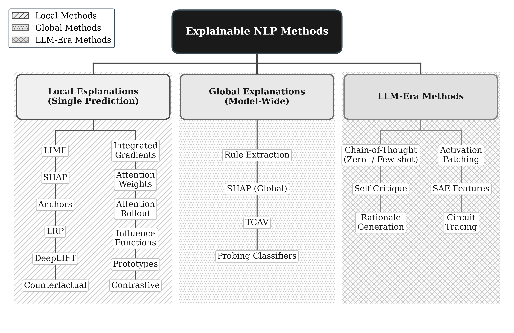
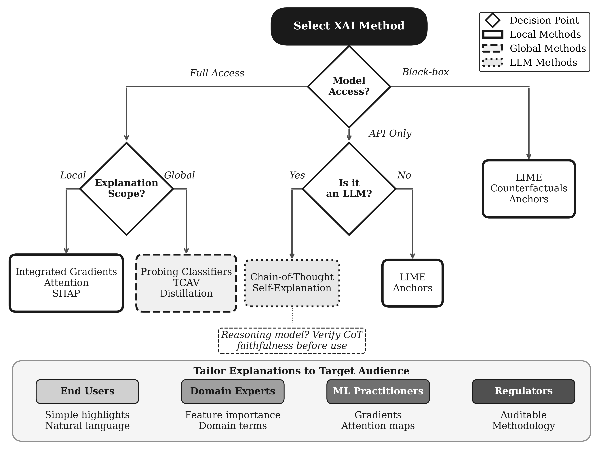

<div align="center">

# Explainable NLP in the Era of Large Language Models

[](https://doi.org/10.5281/zenodo.18521290)
[](https://www.jair.org/)
[](LICENSE)

*A unified taxonomy, evaluation frameworks, and decision guidance for explainable NLP, from LIME to circuit tracing.*

</div>

## Paper

|                  |                                                                          |
| ---------------- | ------------------------------------------------------------------------ |
| **Title**        | Explainable NLP in the Era of Large Language Models: A Unified Taxonomy, Evaluation Frameworks, and Decision Guidance |
| **Authors**      | Hadi Mohammadi, Tina Shahedi |
| **Affiliation**  | Department of Methodology and Statistics, Utrecht University, The Netherlands |
| **Venue**        | Journal of Artificial Intelligence Research (under review, submitted August 2026) |
| **Preprint**     | [10.5281/zenodo.18521290](https://doi.org/10.5281/zenodo.18521290) (earlier and shorter version, Zenodo) |

The accepted version of the manuscript and its LaTeX source will be added here on publication.

## Abstract

Explainable Artificial Intelligence (XAI) has become essential as natural language processing (NLP) models grow increasingly complex and are deployed in high-stakes domains. This survey provides a broad overview of explainability methods for NLP, spanning classical machine learning approaches through the latest developments in large language model (LLM) interpretability.

We make three main contributions: (1) a **unified taxonomy** of explanation methods for NLP organized by scope (local vs. global), mechanism (how the explanation is computed), model access (model-agnostic vs. model-specific), and output form (importance scores, rules, examples, counterfactuals, rationale spans, concepts, natural language); (2) **practical decision frameworks**: guidelines, decision trees, and worked examples for selecting methods by use case, model access, and audience; and (3) an updated synthesis of **LLM-era interpretability**, covering chain-of-thought and its faithfulness in reasoning models, self-explanation, and mechanistic interpretability from sparse autoencoders to circuit tracing.

We review intrinsic and extrinsic evaluation approaches and current benchmarks, and survey applications across healthcare, legal and financial services, social science research, content moderation, and education. We identify key challenges, including faithfulness verification, the attention-explanation debate, and scaling interpretability to billion-parameter models, and outline promising future directions such as human-AI collaborative explanation and responsible deployment.

## Key Contributions

- **Unified taxonomy**: any explanation method is located along four dimensions, namely scope (local vs. global), mechanism (seven values, from perturbation to intrinsic), model access (model-agnostic vs. model-specific), and output form (seven values, from importance scores to natural language). Methods from LIME to circuit tracing sit in one frame and become comparable.
- **Practical decision frameworks**: guidelines, decision trees, task-specific recommendations, and three worked examples that trace method selection end to end on concrete deployments.
- **LLM-era synthesis**: chain-of-thought and its faithfulness in reasoning models, self-explanation, and mechanistic interpretability from sparse autoencoders to circuit tracing, current through mid-2026.
- **Evaluation review**: intrinsic and extrinsic evaluation, current benchmarks, and applications across healthcare, legal and financial services, social science research, content moderation, and education.

## Key Findings

1. **Faithfulness and plausibility come apart.** Plausibility is the easier of the two to obtain, so faithfulness verification belongs before deployment rather than after.
2. **Access decides first.** Which methods are available at all is usually settled by the model access a deployment allows, so access is the first question in method selection rather than the last.
3. **Old ideas under new constraints.** Read against the taxonomy, much of the LLM-era toolbox reinvents earlier ideas under tighter access constraints; the survey separates what is genuinely new from what is rebuilt.

## The Taxonomy at a Glance



Method selection is then worked into a decision tree:



A machine-readable version of the taxonomy is in [`data/taxonomy/taxonomy.json`](data/taxonomy/taxonomy.json).

## Repository Structure

```
xnlp-llm-survey/
├── README.md                  # This file
├── LICENSE                    # CC BY 4.0
├── CITATION.cff               # Citation metadata
├── code/
│   ├── create_figures.py      # Generates all five figures
│   └── requirements.txt       # Python dependencies (matplotlib, numpy)
├── data/
│   └── taxonomy/
│       └── taxonomy.json      # The four-dimensional taxonomy, machine readable
├── figures/                   # The five figures of the survey (PDF vector + PNG)
└── references.bib             # Full bibliography of the survey (216 entries)
```

Every entry in `references.bib` was verified against its authoritative source (ACL Anthology, DBLP, Crossref, OpenReview, PMLR, or the publisher) before inclusion.

## Reproducing the Figures

```bash
git clone https://github.com/mohammadi-hadi/xnlp-llm-survey.git
cd xnlp-llm-survey
pip install -r code/requirements.txt
cd figures && python ../code/create_figures.py
```

The figures are deliberately grayscale with hatch patterns, so they stay legible in black-and-white print, and embed no Type 3 fonts.

## Citation

Until the journal version appears, please cite the Zenodo preprint:

```bibtex
@misc{mohammadi2026xnlp,
  author    = {Mohammadi, Hadi and Shahedi, Tina},
  title     = {Explainable {NLP}: A Comprehensive Survey and Practical Guidelines for Interpretable Text Models},
  year      = {2026},
  publisher = {Zenodo},
  doi       = {10.5281/zenodo.18521290},
  url       = {https://doi.org/10.5281/zenodo.18521290},
  note      = {An extended version is under review at the Journal of Artificial Intelligence Research}
}
```

GitHub's "Cite this repository" button uses [`CITATION.cff`](CITATION.cff) and points at the same record.

## Related Repository

This survey is method-organized. A companion survey by the first author, [xnlp-survey](https://github.com/mohammadi-hadi/xnlp-survey), is domain-organized ("Explainability in Practice: A Survey of Explainable NLP Across Various Domains", under review at the Journal of Information Science). The two papers share no text, tables, or figures.

## License

Released under [CC BY 4.0](LICENSE): reuse freely with attribution.

## Contact

Hadi Mohammadi ([ORCID](https://orcid.org/0000-0003-0860-9200)) · [mohammadi.cv](https://mohammadi.cv)
Tina Shahedi ([ORCID](https://orcid.org/0009-0000-8543-1683))
