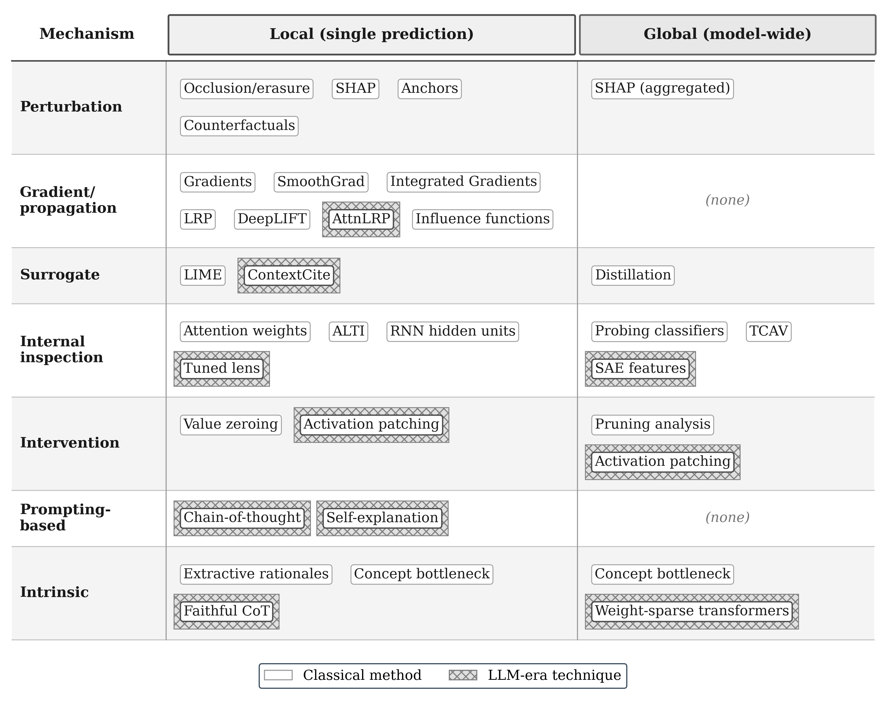
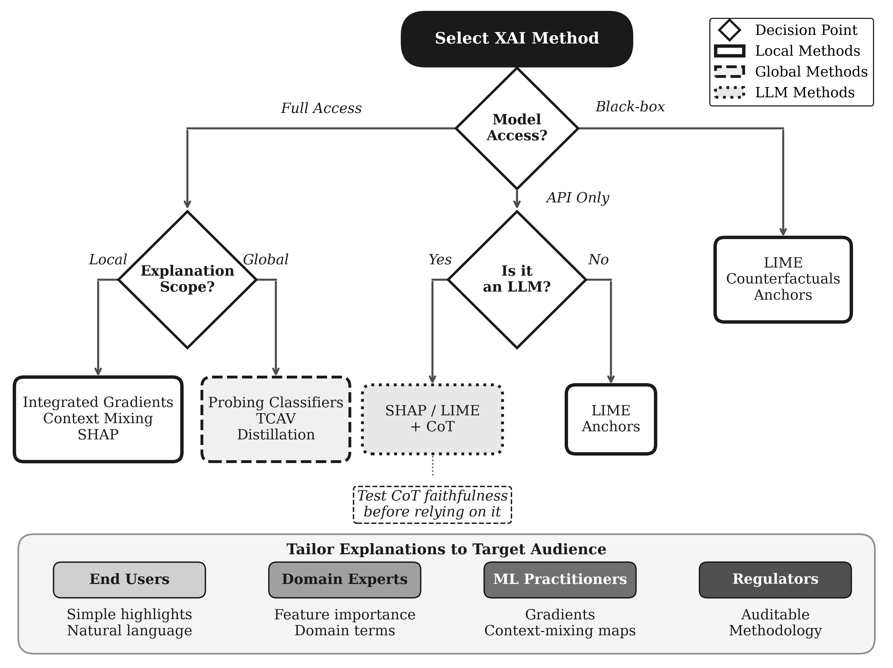

<div align="center">

# Explainable NLP in the Era of Large Language Models

[](https://doi.org/10.5281/zenodo.21899962)
[](https://doi.org/10.5281/zenodo.23135151)
[](LICENSE)

*A unified taxonomy, evaluation frameworks, and decision guidance for explainable NLP, from LIME to circuit tracing.*

</div>

## Paper

|                  |                                                                          |
| ---------------- | ------------------------------------------------------------------------ |
| **Title**        | Explainable NLP in the Era of Large Language Models: A Unified Taxonomy, Evaluation Frameworks, and Decision Guidance |
| **Authors**      | Hadi Mohammadi, Tina Shahedi |
| **Affiliation**  | Department of Methodology, Statistics & Data Science, Utrecht University, The Netherlands |
| **Preprint**     | [10.5281/zenodo.23135151](https://doi.org/10.5281/zenodo.23135151) (version 2.0, October 2026, Zenodo) |
| **Earlier version** | [10.5281/zenodo.18521290](https://doi.org/10.5281/zenodo.18521290) (version 1.0, February 2026, shorter) |
| **Materials archive** | [10.5281/zenodo.21899962](https://doi.org/10.5281/zenodo.21899962) (this repository) |

The preprint PDF is on Zenodo. The LaTeX source will be added here on publication.

## Abstract

Explanation methods for natural language processing (NLP) come from two literatures that rarely meet: feature attribution and probing for task models, and the interpretability of large language models (LLMs), from chain-of-thought reasoning to sparse autoencoder features and circuit tracing. We place both in a unified taxonomy with four dimensions: scope (local vs. global), mechanism (how the explanation is computed), model access (model-agnostic vs. model-specific), and output form (importance scores, rules, examples, counterfactuals, rationale spans, concepts, natural language).

Faithfulness and plausibility come apart, and the erasure tests built for extracted rationales do not apply to a chain of thought, which is an output rather than part of the input, so chains of thought need intervention tests of their own. The access a deployment allows settles which mechanisms are usable before scope or audience matter; our practical decision frameworks start from that question and are traced through three worked deployments. In our synthesis of LLM-era interpretability, a lineage table shows that most current techniques rebuild or extend older ideas under new constraints of scale and access, while two problems are new: keeping reasoning traces monitorable under training pressure, and testing whether models can introspect. Faithfulness metrics disagree with one another, and sparse autoencoders do not yet beat simple baselines on standardized benchmarks, so evaluations should name the tests they ran instead of reporting one score.

We also survey applications across healthcare, legal and financial services, social science research, content moderation, and education, and close with six open problems.

## Key Contributions

- **Unified taxonomy**: any explanation method is located along four dimensions, namely scope (local vs. global), mechanism (seven values, from perturbation to intrinsic), model access (model-agnostic vs. model-specific), and output form (seven values, from importance scores to natural language). Methods from LIME to circuit tracing sit in one frame and become comparable.
- **Practical decision frameworks**: guidelines, decision trees, task-specific recommendations, and three worked examples that trace method selection end to end on concrete deployments.
- **LLM-era synthesis**: chain-of-thought and its faithfulness in reasoning models, self-explanation, and mechanistic interpretability from sparse autoencoders to circuit tracing, current through September 2026.
- **Evaluation review**: intrinsic and extrinsic evaluation, current benchmarks, and applications across healthcare, legal and financial services, social science research, content moderation, and education.

## Key Findings

1. **Faithfulness and plausibility come apart, and the erasure tests do not transfer to a chain of thought.** A chain of thought is an output, so tests of it intervene on the trace.
2. **Access settles which mechanisms are usable before scope or audience matter.** The decision trees start from the access a deployment allows.
3. **Most LLM-era techniques rebuild or extend older ideas.** Ten of the twelve techniques in the lineage table have a classical counterpart; two problems are new: keeping reasoning traces monitorable, and testing introspection.
4. **Faithfulness metrics disagree, and dictionary features do not yet beat simple baselines.** Evaluations should name the tests they ran.
5. **Explanations raise acceptance of model outputs more reliably than they raise decision quality.** Extrinsic evaluation should measure the decisions people make.

## The Taxonomy at a Glance



Method selection is then worked into a decision tree:



A machine-readable version of the taxonomy is in [`data/taxonomy/taxonomy.json`](data/taxonomy/taxonomy.json).

## Repository Structure

```
xnlp-llm-survey/
├── README.md                  # This file
├── LICENSE                    # CC BY 4.0
├── CITATION.cff               # Citation metadata
├── code/
│   ├── create_figures.py      # Generates the figures (also draws three used only in earlier versions)
│   └── requirements.txt       # Python dependencies (matplotlib, numpy)
├── data/
│   └── taxonomy/
│       └── taxonomy.json      # The four-dimensional taxonomy, machine readable
├── figures/                   # The two figures of the survey (PDF vector + PNG)
└── references.bib             # Full bibliography of the survey (304 entries, 282 cited)
```

Every entry in `references.bib` was verified against its authoritative source (ACL Anthology, DBLP, Crossref, OpenReview, PMLR, or the publisher) before inclusion.

## Reproducing the Figures

```bash
git clone https://github.com/mohammadi-hadi/xnlp-llm-survey.git
cd xnlp-llm-survey
pip install -r code/requirements.txt
cd figures && python ../code/create_figures.py
```

The figures are deliberately grayscale with hatch patterns, so they stay legible in black-and-white print, and embed no Type 3 fonts.

## Citation

Until a journal version appears, please cite the preprint:

```bibtex
@misc{mohammadi2026xnlp,
  author    = {Mohammadi, Hadi and Shahedi, Tina},
  title     = {Explainable {NLP} in the Era of Large Language Models: A Unified Taxonomy, Evaluation Frameworks, and Decision Guidance},
  year      = {2026},
  publisher = {Zenodo},
  version   = {v2.0},
  doi       = {10.5281/zenodo.23135151},
  url       = {https://doi.org/10.5281/zenodo.23135151},
  note      = {Preprint}
}
```

If you use the materials in this repository (figures, taxonomy, bibliography), cite its archive as well:

```bibtex
@software{mohammadi2026xnlpmaterials,
  author    = {Mohammadi, Hadi and Shahedi, Tina},
  title     = {Explainable {NLP} in the Era of Large Language Models: Survey Materials},
  year      = {2026},
  publisher = {Zenodo},
  version   = {v1.0.0},
  doi       = {10.5281/zenodo.21899962},
  url       = {https://doi.org/10.5281/zenodo.21899962}
}
```

GitHub's "Cite this repository" button uses [`CITATION.cff`](CITATION.cff).

## Related Repository

This survey is method-organized. A companion survey by the first author, [xnlp-survey](https://github.com/mohammadi-hadi/xnlp-survey), is domain-organized ("Explainability in Practice: A Survey of Explainable NLP Across Various Domains", under review at the Journal of Information Science). The two papers share no text, tables, or figures.

## License

Released under [CC BY 4.0](LICENSE): reuse freely with attribution.

## Contact

Hadi Mohammadi ([ORCID](https://orcid.org/0000-0003-0860-9200)) · [mohammadi.cv](https://mohammadi.cv)
Tina Shahedi ([ORCID](https://orcid.org/0009-0000-8543-1683))
